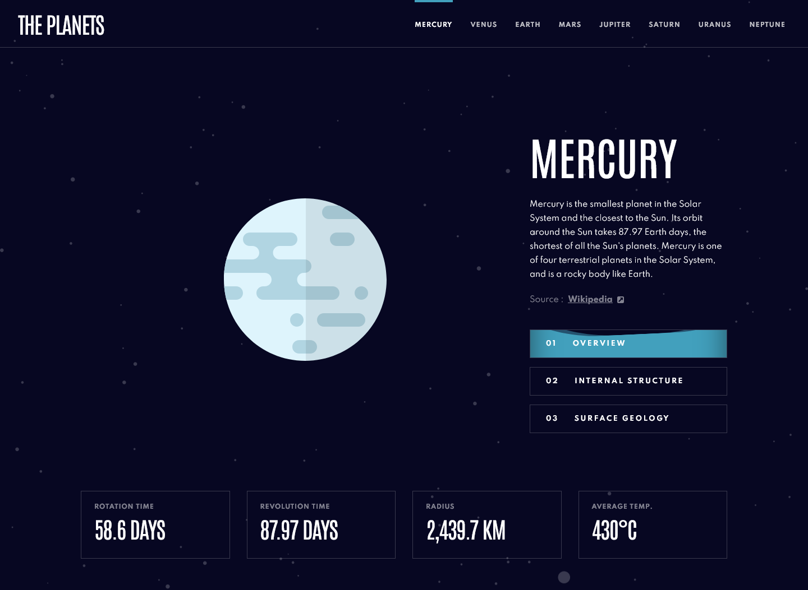
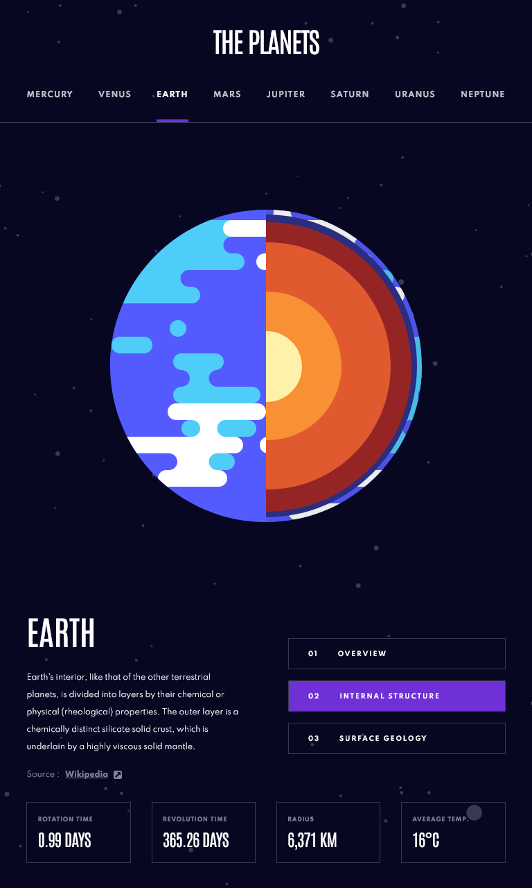
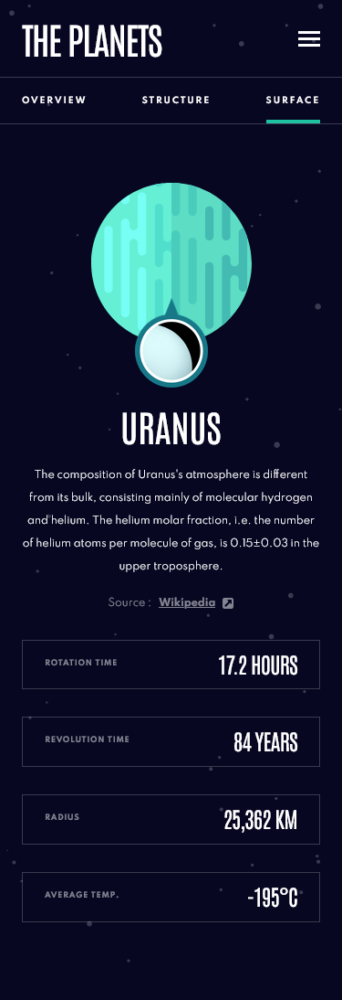

# Frontend Mentor - Planets fact site solution

This is a solution to the [Planets fact site challenge on Frontend Mentor](https://www.frontendmentor.io/challenges/planets-fact-site-gazqN8w_f) coded by [Alain-sys](https://github.com/Alain-sys)

## Table of contents

- [Overview](#overview)
  - [The challenge](#the-challenge)
  - [Screenshot](#screenshot)
  - [Links](#links)
- [My process](#my-process)
  - [Built with](#built-with)
  - [What I learned](#what-i-learned)
  - [Continued development](#continued-development)
  - [Useful resources](#useful-resources)
- [Author](#author)
- [Acknowledgments](#acknowledgments)

## Overview

### The challenge

Users should be able to:

- View the optimal layout for the app depending on their device's screen size
- See hover states for all interactive elements on the page
- View each planet page and toggle between "Overview", "Internal Structure", and "Surface Geology"

### Screenshot

  
Desktop

  

  
Tablet

  

  
Mobile

  

    
    
  

### Links

- [Live Site URL](https://alain-sys.github.io/planets-fact-site/)
- [Solution URL](https://www.frontendmentor.io/solutions/planets-fact-site-in-react-Y1eAMSO2DE)

## My process

### Built with

- [React](https://reactjs.org/) - JS library
- CSS custom properties
- Flexbox

### What I learned

It was my first project in React and i learned a lot with this project.

### Continued development

I continue to learn React with other projects. I also would like to learn Sass.

### Useful resources

- [React](https://beta.reactjs.org/learn)
- [MDN](https://developer.mozilla.org/fr/)
- [Stackoverflow](https://stackoverflow.com/) 

## Author

- Frontend Mentor - [@Alain-sys](https://www.frontendmentor.io/profile/Alain-sys)
- Twitter - [@Alain_sys](https://twitter.com/Alain_sys)

## Acknowledgments

Thanks to [Clément Creusat](https://www.frontendmentor.io/profile/ccreusat). His planets fact site code helped me to use data.json with React.
